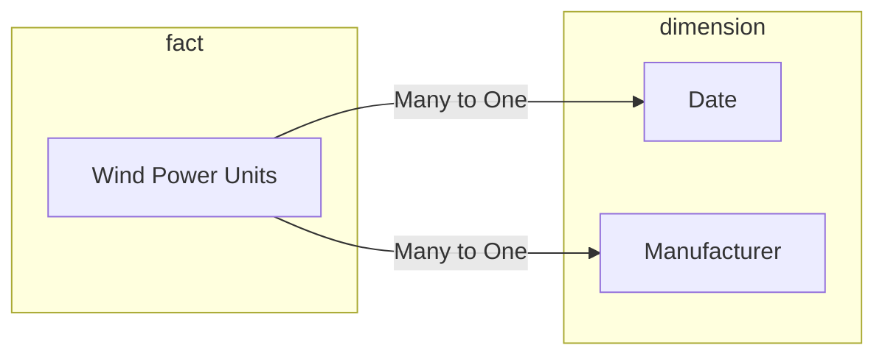
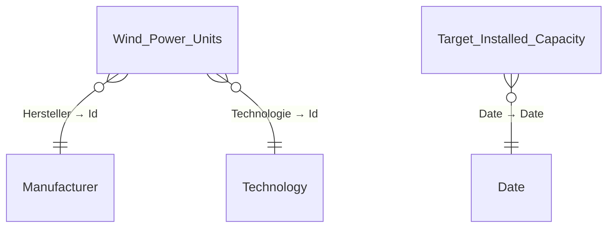
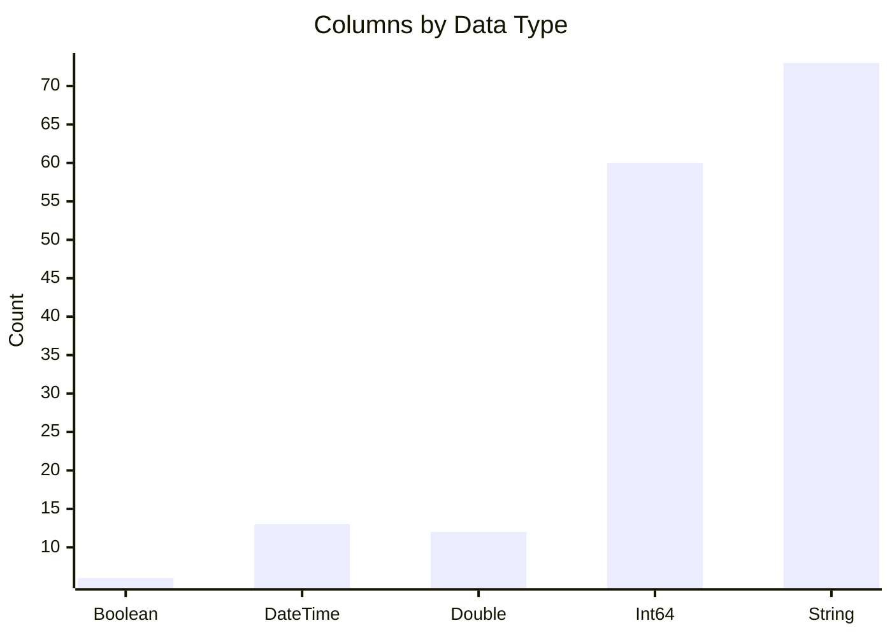
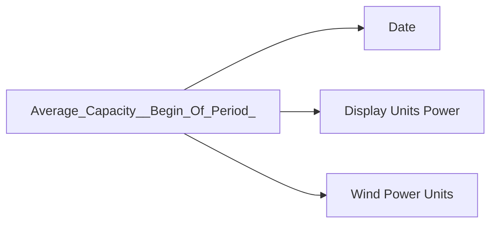
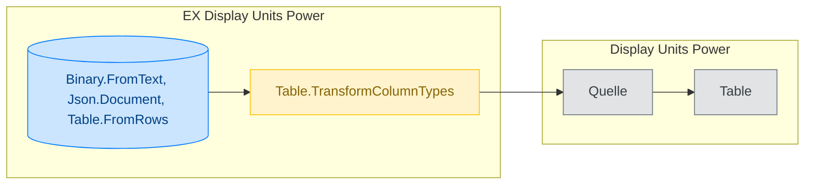

# Documentation of Generated Files

This help describes the six Markdown files that `generate_docs.py` produces per Semantic Model. Each chapter describes the structure, purpose and contains examples from the generated documentation.

> All files are stored in the folder `docs/output/{model_name}/`.

---

## Table of Contents

1. [model_documentation.md](#1-model_documentationmd)
2. [table_documentation.md](#2-table_documentationmd)
3. [measure_documentation.md](#3-measure_documentationmd)
4. [udf_documentation.md](#4-udf_documentationmd)
5. [calculation_item_documentation.md](#5-calculation_item_documentationmd)
6. [import_logic_documentation.md](#6-import_logic_documentationmd)

---

## 1. model_documentation.md

The entry file for the Semantic Model. It provides an overall overview of the model's purpose, structure and quality, and links to the other detailed documentation files.

### Sections

#### Title Block & Metadata

Shows workspace, last update of the model documentation and of the AI descriptions.

**Purpose:** Quick orientation on whether the documentation is up to date.


> **Semantic Model:** `wind_power_germany`  
> **Workspace:** WindPowerGermany  
> **Last update of model documentation:** 2026-03-11  
> **Last update of ai descriptions:** 2026-03-12  


#### Purpose & Domain

AI-generated summary explaining the business purpose of the model and the domain it was built for.

**Purpose:** Business entry point for new team members or stakeholders who want to know what the model is for.

The model is designed to analyze the development, distribution, and characteristics
of wind power units in Germany. It supports tracking installed capacity, unit counts,
and average capacities over time, segmented by manufacturer, technology, operational
status, and geography.


#### Semantic Model Key Facts

Contains four subsections:

| Subsection | Purpose |
|---|---|
| **Load Strategy** | Shows how many tables use which load strategy (Import, DirectQuery, Dual). Helps estimate refresh times. |
| **Data Sources & Parameters** | Lists all data sources with type, description and number of affected tables. Allows identification of local file paths, embedded data and external sources. |
| **Key Properties** | Key metrics of the model: number of tables, columns, measures, relationships, UDFs, calculation groups, model size. Useful for capacity planning and model comparisons. |
| **Errors** | List of errors (measures, tables, columns, UDFs) and RI violations. Immediately shows whether action is needed. |

**Example — Data Sources & Parameters:**

| Type | Description | Details | Number of tables affected |
|------|-------------|---------|-------------------------:|
| datasource | EmbeddedData: User-entered data | see [Table documentation](...) | 2 |
| datasource | File: File.Contents | C:\Users\Paul\...\EinheitenWind.xml | 1 |

#### Data Model Architecture

Mermaid graph of the data model, grouped by roles (Dimension, Fact, no_relationship), followed by an AI-generated explanation of the architecture.

**Purpose:** Visual understanding of the model structure and relationships at a glance — without needing to open Power BI.



#### Key Analytical Capabilities

AI-generated list of the model's key analytical capabilities.

**Purpose:** Quick overview of which analytical questions can be answered with the model.

- Dynamic measure selection for flexible metric analysis
- Time intelligence calculations (period over period, moving averages)
- Outlier detection and anomaly analysis
- Progress tracking against installed capacity targets

#### Data Quality Notes

Contains Description Coverage (how many objects have a description), specific issues (RI violations, orphan tables) and an AI-generated summary of the quality situation.

**Purpose:** Identification of data quality issues and documentation gaps. Also shows hints about test data or development servers.


| Entity | Total | With Description | Without | % Covered (non-hidden) |
|--------|------:|-----------------:|--------:|----------------------:|
| Tables | 15 | 0 | 15 | 0% |
| Columns | 164 | 4 | 160 | 2% |
| Measures | 25 | 0 | 25 | 0% |

| Category | Object | Detail |
|----------|--------|--------|
| RI Violation | Manufacturer | 1 referential integrity violations |
| Orphan Table | HTML_Test | No relationships — potentially disconnected |


#### Related Documentation

Links to the five other documentation files.

**Purpose:** Navigation between documents.

---

## 2. table_documentation.md

Detailed documentation of all tables and columns in the model.

### Sections

#### Table Overview (ER Diagram)

Mermaid ER diagram showing all tables with their relationships (including column references in relationships), followed by an AI-generated explanation.

**Purpose:** Business model understanding — which tables are connected and how. Useful for report creators and data modellers.



#### Tables in the Semantic Model

Alphabetically sorted overview table of all tables with role, row count, relationships and AI description. Each table name is an anchor link to the detail section.

**Purpose:** Quick lookup of table information. The AI descriptions explain the business purpose of each table.


| # | Table Name | Role | Rows | Relationships (1:N / N:1) | Description |
|--:|-----------|------|-----:|:-------------------------:|-------------|
| 1 | [Date](#date-dimension) | dimension | 9,862 | 1 / 0 | The Date table is a comprehensive calendar dimension... |
| 2 | [Wind Power Units](#wind-power-units-fact) | fact | 39,419 | 0 / 6 | Wind Power Units is the central fact table... |


#### Per-Table Sections

For each table (sorted alphabetically) a dedicated section with:

| Element | Purpose |
|---|---|
| **AI Description** | Business explanation of what the table contains and what it is used for. |
| **Properties Table** | Technical properties (role, rows, hidden, RI violations, relationships, aggregating/filtering measures). |
| **Link to Import Logic** | Direct link to the corresponding section in the import logic documentation. |
| **Column Table** | All columns with data type, format, hidden, key, cardinality and AI description. |
| **Relationship Context Diagram** | Colour-coded Mermaid flow diagram of this table's relationships (Blue = Focus, Green = Dimension, Orange = Fact, Grey = Inactive). |
| **Navigation** | Link back to the table overview. |

**Example — Relationship Context Diagram:**


🔵 Focus table  |  🟢 Dimension  |  🟠 Fact  |  ⚪ Inactive relationship only


**Example — Column Table (excerpt):**


| Column | Data Type | Format | Hidden | Key | Cardinality | Description |
|--------|-----------|--------|:------:|:---:|------------:|-------------|
| Calendar Week | Int64 | 0 | false | false | 54 | calendar week |
| Date | DateTime | Long Date | false | false | 9,862 | Date contains the calendar date and serves as the primary key... |


#### Column Statistics Summary

Bar chart and key metrics table on the distribution of columns by data type.

**Purpose:** Quick overview of the column landscape — e.g. whether the model has mostly string or numeric columns. Also shows hidden, key and calculated columns.




| Metric | Count |
|--------|------:|
| Total columns | 164 |
| Hidden columns | 4 |


#### Data Source Summary

Bar chart and table of data sources by type.

**Purpose:** Overview of where the data comes from (embedded, files, databases). Helps assess production readiness.


| Source Type | Tables |
|------------|-------:|
| EmbeddedData: User-entered data | 5 |
| File: File.Contents | 10 |
| Unknown | 5 |


---

## 3. measure_documentation.md

Documentation of all DAX measures in the model.

### Sections

#### Title Block

Metadata and total number of measures.

> **Total Measures:** 25


#### Measure Summary

Alphabetically sorted overview table of all measures with home table, display folder, AI description and format. Each name is an anchor link to the detail section.

**Purpose:** Quick lookup of a measure and overview of available metrics.


| # | Measure Name | Home Table | Display Folder | Description | Format |
|--:|-------------|------------|----------------|-------------|--------|
| 1 | [Average Capacity (Begin Of Period)](#average-capacity-begin-of-period) | Measure | — | Average Capacity ... | — |
| 2 | [Dynamic Measure (Begin Of Period)](#dynamic-measure-begin-of-period) | Measure | — | Dynamic Measure ... | Format String Expression |


#### Per-Measure Details

For each measure (sorted alphabetically):

| Element | Purpose |
|---|---|
| **Logic & Meaning** | AI-generated explanation of the calculation logic and business purpose. |
| **DAX Expression** | The complete DAX code — enables code review without opening Power BI. |
| **Format String Expression** | If present: the dynamic format expression including AI description. |
| **Measure Properties** | Home table, display folder, data type, number of dependencies, referencing measures, expression length, hidden status. |
| **Table Dependencies** | Mermaid flow diagram showing which tables the measure reads/filters. |
| **Navigation** | Link back to the Measure Summary. |

**Example — DAX Expression:**


#### DAX Expression

```dax
DIVIDE(
    [Installed Capacity (Begin Of Period)],
    [Installed Power Units (Begin Of Period)],
    BLANK()
)
```


**Example — Table Dependencies:**





#### Key Observations

AI-generated summary of patterns and notable findings in the measure landscape.

**Purpose:** Identification of design decisions, redundancies or potential problems without having to analyse each measure individually.


Measures are designed for flexible analysis, supporting dynamic switching between
installed capacity, unit counts, and average capacity. Time intelligence and
statistical measures enable period-over-period comparisons and outlier detection.


---

## 4. udf_documentation.md

Documentation of all User Defined Functions (UDFs) — reusable DAX functions in the model.

### Sections

#### Title Block

Metadata, total count and classification of UDFs (model-dependent vs. model-independent).

**Purpose:** Quick assessment of whether and how many reusable functions exist.


> **Total UDFs:** 1 | Model-Dependent: 1 | Model-Independent: 0


#### UDF Details (per UDF)

If UDFs are present, each entry contains:

| Element | Purpose |
|---|---|
| **Classification Badge** | 🔴 Model-Dependent or 🟢 Model-Independent — shows whether the function is tied to model-specific tables. |
| **Properties Table** | Hidden status, classification, description, model dependencies. |
| **DAX Code** | Complete function code for review and understanding. |
| **AI Analysis** | AI-generated explanation of the function logic. |
| **DAX Semantic Analysis** | Breakdown of referenced filters and tables. |
| **Referencing Measures** | Table of measures that use this UDF. |

**Example — UDF Entry (excerpt):**


### FormatDisplayUnitsCount

| Property | Value |
|----------|-------|
| **Classification** | 🔴 Model-Dependent |
| **Description** | FormatDisplayUnitsCount dynamically formats countable numbers or sums... |
| **Model Dependencies** | 'Display Units Count';'Display Units Count'[Format String];... |

```dax
() = > 
VAR result = SWITCH(
    SELECTEDVALUE('Display Units COUNT'[Unit], BLANK()),
    "K", SELECTEDVALUE('Display Units COUNT'[Format String]),
    "M", SELECTEDVALUE('Display Units COUNT'[Format String]),
    ...
)
RETURN result
```


#### Overview (AI-generated)

AI-generated summary of the UDF landscape. If no UDFs are present, it explains how the model implements reusable logic instead.

**Purpose:** Contextualisation of UDF usage within the overall model.


No user-defined functions (UDFs) are present. Reusable logic is implemented via
measures and calculation groups, supporting dynamic analytics and time intelligence.


---

## 5. calculation_item_documentation.md

Documentation of all Calculation Items (Calculation Groups) in the model.

### Sections

#### Title Block

Metadata and total number of calculation items.


> **Total Calculation Items:** 12


#### Calculation Groups Overview

Overview table of all calculation groups with precedence, item count and AI description, followed by an AI-generated explanation of the calculation group landscape.

**Purpose:** Understanding which calculation groups exist and how they interact (e.g. precedence order).


| Calculation Group | Precedence | Items | Description |
|-------------------|:----------:|------:|-------------|
| Calculation group | 0 | 12 | The Calculation group table contains calculation items for time intelligence... |


#### Per-Calculation-Item Details

Grouped by calculation group. For each calculation item:

| Element | Purpose |
|---|---|
| **Description Table** | Name and AI description of each item. |
| **DAX Code** | Complete calculation code — enables review of time intelligence, outlier detection, etc. |
| **Error State** | If faulty, the error status is displayed. |

**Purpose:** Understanding dynamic measure transformations. Especially important for time intelligence (YoY, MoM) and statistical calculations (Z-Score, standard deviation).

**Example — Calculation Item:**


#### Current With Blank (Zero Conversion)

```dax
// returns the selected timeseries but replaces blank values by zero
VAR result = COALESCE(
    SELECTEDMEASURE(),
    0
)
RETURN result
```


---

## 6. import_logic_documentation.md

Documentation of the Power Query (M) import logic for all tables.

### Sections

#### Review of Import Logic Design

AI-generated assessment of import logic quality across all tables.

**Purpose:** Identification of issues such as hardcoded file paths, lack of parameterisation or expensive operations. Provides recommendations for improving production readiness.


The import logic relies heavily on hardcoded local file paths for key tables, which
is problematic for production deployment. Embedded user-entered JSON is used for
several dimension tables, which, while portable, may lack validation and completeness.


#### Import Logic Summary

Overview table of all tables with total steps, expensive steps and estimated total cost.

**Purpose:** Quick identification of the most complex import logic and potential performance bottlenecks. The cost estimate enables prioritisation during optimisation.


| Table Name | Total Steps | Expensive Steps | Total Cost Estimation |
|------------|------------:|----------------:|----------------------:|
| Date | 82 | 1 | 193.5 |
| Wind Power Units | 14 | 0 | 37.5 |
| Display Units Power | 5 | 0 | 15.0 |


#### Per-Table Import Logic

For each table a dedicated section with:

| Element | Purpose |
|---|---|
| **AI Summary** | Business assessment of the import logic. Warns about hardcoded paths, test data or dev servers. |
| **Link to Table Definition** | Direct link to the corresponding section in the Table Documentation. |
| **Key Import Facts** | Rows, columns, total steps, total cost. |
| **Cost Group Breakdown** | Colour-coded breakdown by cost group (None/Cheap/Moderate/Expensive). |
| **Expensive Operations** | Details on expensive operations (step number, name, functions used, cost, Power Query code). |
| **Mermaid Flowchart** | Visual flowchart of import steps. Colour-coded by cost group. Shows dependencies between steps and subqueries. |

**Purpose:** Traceability of ETL logic per table. Enables performance analysis and review of data sources.

**Example — Cost Group Breakdown:**


| | Cost Group | Number of Steps | Total Cost Estimation |
|:-:|------------|----------------:|----------------------:|
| 🔘 | None (root/navigation) | 3 | — |
| 🟢 | Cheap | 0 | 0.0 |
| 🟡 | Moderate | 2 | 15.0 |
| 🔴 | Expensive | 0 | 0.0 |


**Example — Import Logic Flowchart:**





---

## Colour Coding and Conventions

The documentation consistently uses colour coding:

| Context | Colour | Meaning |
|---|---|---|
| **Data Model Diagram** | 🔵 Blue | Focus table |
| | 🟢 Green | Dimension |
| | 🟠 Orange | Fact |
| | ⚪ Grey | Inactive relationship only |
| **Import Costs** | ⬜ Grey | None (Navigation/Root) |
| | 🟢 Green | Cheap |
| | 🟡 Yellow | Moderate |
| | 🔴 Red | Expensive |
| | 🔵 Blue | Data source |

All sections use anchor links for navigation between overview tables and detail sections.
